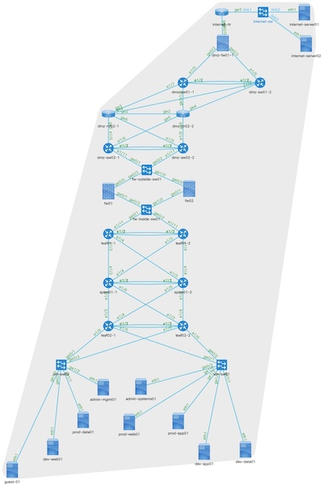

# NSO Getting Started Lab
This repository contains resources and labs designed to help engineers get started using [Cisco NSO](https://developer.cisco.com/nso). 

## Sample Network

If you have a lab network ready to go, feel free to use that - but we've included a [VIRL topology file](topology.virl) with this lab that we will use for our examples.  Feel free to fire ,up your own instance of this VIRL network either using your own VIRL server, or go reserve one from [DevNet Sandbox - Multi-IOS Test Network](https://devnetsandbox.cisco.com/RM/Diagram/Index/6b023525-4e7f-4755-81ae-05ac500d464a?diagramType=Topology)

## NSO 101: Your first afternoon
These labs will help you go from zero to NSO hero.  

1. [Learn how to install NSO](01-installing-nso.md)
1. [Connect NSO to your network](02-connecting-to-network.md)
1. [Explore the NSO CLI](03-exploring-with-cli.md)
1. [Cleaning Up Your Environment](99-cleanup.md)

## Minimum Viable Use Cases
Here are a few example real-world use cases that every network engineer can relate to solved with NSO. 

1. [Gather the MAC Addresses from the Network](04b-mvu.md)
1. [Verify Network Configuration Compliance](04c-mvu.md)
1. [Update SNMP Community Strings Across the Network](04a-mvu.md)

## References
Here are some handy links to resources related to getting started with Cisco NSO.

* [NSO on DevNet](https://developer.cisco.com/site/nso/)
* [Getting NSO!](https://developer.cisco.com/docs/nso/#!getting-nso)
* [NSO Developer on GitHub](http://github.com/nso-developer)
* [NSO Community](https://community.cisco.com/t5/nso-developer-hub/ct-p/5672j-dev-nso)
* [Learning Lab: NSO usage for different users](https://developer.cisco.com/learning/modules/nso)
* [Learning Lab: NSO Basics by Cisco IT](https://developer.cisco.com/learning/modules/nso-basics)
* [NSO 5 Day Training](https://github.com/NSO-developer/nso-5-day-training)